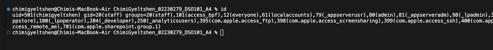

# Secure CI/CD Pipeline with Docker and GitHub Actions


## Table of Contents
- [Overview](#overview)
- [Docker Security Implementation](#docker-security-implementation)
- [Jenkins Secure Pipeline](#jenkins-secure-pipeline)
- [GitHub Actions Secure Pipeline](#github-actions-secure-pipeline)
- [Screenshots](#screenshots)
- [Academic Honesty Declaration](#academic-honesty-declaration)

---


## 📝 Overview

This assignment focuses on implementing **secure CI/CD pipelines** using:
- Docker best practices
- Jenkins with credential management
- GitHub Actions with secret storage

The goal is to demonstrate how to **securely build and deploy** applications using these modern DevOps tools.

Github repository we will be using: [Secure CI/CD Pipeline](https://github.com/C-gyeltshen/iBEST_INSTITUTE_WEBSITE.git)

---

## Docker Security Implementation

As a `root user`, one can run all the `docker` commands by connecting to its `Daemon`; without any restrictions. But we can not give root access to everyone on the system as it is unsafe.

So we need to figure out ways to give `docker` access to `non-root` users.

* **Root user**: When the `system is installed` it creates a `root account` with password protected and only the admin knows the password. 

* Root user account has all the access as a superuser. **It can access all the programs**, files and resources on the system. The user **id 0** gives the root user all the privileges. 

* Admin can give custom names instead of root but some applications run with root user name only.

* **Non-root users**: Non-admin users, can run only **specific set of commands** as per their **roles and permissions** given. Two types of Users in non-root user category. Users with admin privileges and users with non-admin privileges.

* #### To get the `name` of current user

    ```bash
    id
    ```

    

* #### To `switch` the `user`.

    ```bash
    su - <username>
    ```

* #### To `change the password` of current login account

    ```bash
    passwd
    ```

* #### To `see` users information.

```bash 
cat /etc/passwd
```

### Steps: 

1. **Create Dockerfile**: 

   ```bash
   touch Dockerfile
   ```

2. **Add normal Dockerfile content**: 

    ```dockerfile
    FROM node:18

    WORKDIR /app
    COPY package*.json ./

    # Install dependencies before switching user (some packages may need root)
    RUN npm install

    COPY . .

    # Switch to non-root user AFTER setup
    USER appuser

    RUN npm run build

    EXPOSE 3000
    CMD ["npm", "run", "start"]

    ```

3. **Add a new line to the Dockerfile.**

    ```dockerfile
    RUN addgroup -S appgroup && adduser -S appuser -G appgroup
    USER appuser
    ```
**Breakdown:**

1. `addgroup -S appgroup`

    - Creates a system group called `appgroup`.
    - The `-S` flag means it's a `system group`, not a regular user group. System groups are typically used for service accounts.

2. `adduser -S appuser -G appgroup`

    - Creates a **system user** called `appuser`.

    - Adds that user to the `appgroup` group.

    - The `-S` flag again makes this a system user.

3. `USER appuser`

    - Switches to using the `appuser` as the **default user** from this point onward in the Docker container.

    - Any subsequent commands (like CMD, or app execution) will run `without root privileges`.

## Jenkins secure pipeline

### Steps:
1. **Create a Jenkinsfile**: 

   ```bash
   touch Jenkinsfile
   ```
2. **Add the following content to the Jenkinsfile**:

    ```groovy
    pipeline {
        agent any

        environment {
            DOCKER_CREDENTIALS_ID = 'docker-credentials-id'
        }

        stages {
            stage('Build') {
                steps {
                    script {
                        docker.build('my-app')
                    }
                }
            }

            stage('Test') {
                steps {
                    sh 'docker run my-app npm test'
                }
            }

            stage('Deploy') {
                steps {
                    withCredentials([usernamePassword(credentialsId: env.DOCKER_CREDENTIALS_ID, usernameVariable: 'DOCKER_USERNAME', passwordVariable: 'DOCKER_PASSWORD')]) {
                        sh 'docker login -u $DOCKER_USERNAME -p $DOCKER_PASSWORD'
                        sh 'docker push my-app'
                    }
                }
            }
        }
    }
    ```
3. **Add credentials in Jenkins**:
   - Go to `Jenkins Dashboard` > `Manage Jenkins` > `Manage Credentials`.
   - Add a new credential with the ID `docker-credentials-id`, using your Docker Hub username and password.